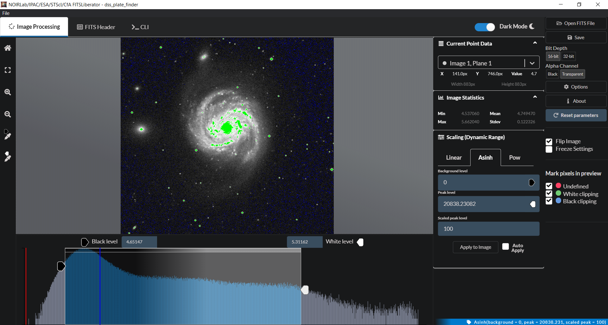

# FITS Liberator

## Available Scripts

In the project directory, you can run (using npm or yarn):

## running  DevServer with electron 
Runs the app in development mode

### `npm start ` 

# build process

## Windows
`npm run build:win`
## Linux
`npm run build:linux`
## Mac
`npm run build:mac`

## Extra

`npm run react-build` or `npm run react-build`

Builds the app for production to the build folder. It correctly bundles React in production mode and optimizes the build for the best performance.

The build is minified and the filenames include the hashes.

Your app is ready to be deployed.

## Easy to develop

 devServer react

`npm run gui`

 electron process

 `npm run electron`

By default, it writes logs to the following locations:

 - **on Linux:** `~/.config/\fitsliberator/logs/*.log`
 - **on macOS:** `~/Library/Logs/\fitsliberator/*.log`
 - **on Windows:** `%USERPROFILE%\AppData\Roaming\fitsliberator\logs\*.log`

